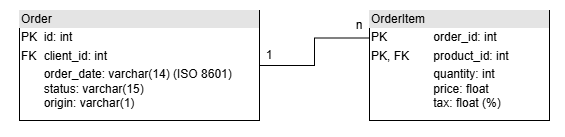

# **OCaml ETL**

## **1. Introduction**

This report follows the development of the OCaml ETL project. The project is a simple ETL (Extract, Transform, Load) tool that reads data from a CSV file exposed via HTTP request, transforms the data to calculate outputs, and writes them to a SQLite database or a new CSSV file.

The goal of this report is to describe each step of the project, from the initial requirements and inputs to the final implementation. In this way, it can be a useful guide for future developers who want to understand the project's architecture and implementation details, and maybe develop their own.

***If you are looking for a quick overview of the project or simply documentation, you can check the `README` file in the project's repository. It contains a brief description of the project, the requirements, and instructions on how to run the project. It also shows how to access the project's documentation HTML page, using the `odoc`.***

## **2. Overview**

The goal of this ETL project is to process data from a source (a CSV file), apply transformations, and store the result in another resource (a new CSV file).

The project is based on two tables that represent a small part of a management software system: one table for orders and another containing the items of each order.

In a real-world scenario, direct access to the database may be impractical due to security and performance reasons. Therefore, a daily process extracts the relevant data and generates a copy in a shared file.

The final goal is to provide the processed data to the manager, who will use this information to feed a dashboard with aggregated order visualizations.

## **3. Inputs**

The first step of a data processing project is to understand the inputs. In this case, the following details were provided by the project manager:

Daily, two files will be available for processing.

The first file contains data from the `Order` table, which records the orders selected for the day. This table has a primary key (`id`), which uniquely identifies each order. In addition to the identifier, it contains the client ID (`client_id`), the order date (`order_date`), the order status (`status`), and the order origin (`origin`).

Orders can have statuses such as pending, complete, or cancelled. The origin can be `P` for physical or `O` for online, i.e., via the web.

The second file contains data from the `OrderItem` table, which records the items of each order. A single order can have multiple items, and the relationship is established via the `order_id` field. This field, together with `product_id`, forms the primary key (unique identifier) of the table.

It also includes the quantity (`quantity`), the price paid at the time of purchase (`price`), and the product tax in percentage format (`tax`). Since the sale price of a product can vary over time, it is essential to store the agreed-upon price at the time of the order.

The `Clients` and `Products` tables are not provided, as they are not relevant for the aggregated visualization dashboard.

### *MER Diagram*



### *Outputs and Filtering*

The manager would like to receive a CSV file containing 3 fields: `order_id`, `total_amount`, and `total_taxes`. `total_amount` contains the total value of the order, that is, the sum of the revenue from all items in an order. Revenue is calculated by multiplying the price by the quantity. `total_taxes` contains the sum of the tax paid on all items. The tax is calculated as the percentage multiplied by the revenue of each item.   The manager would like to be able to parameterize the output based on specific `status` and `origin` values of the orders.

## **4. Project Structure**

The project is entirely implemented in OCaml, utilizing the `dune` build system. The project is divided into the following modules:

- `bin`: Contains the main executable file.
- `lib`: Contains the main logic of the project.
    * `extractor`: Contains the logic to extract the data.
    * `transformer`: Contains the logic to transform the data.
    * `loader`: Contains the logic to load the data.
    * `helper`: Contains helper functions used especially to parse the input into the correct data types.
    * `types`: Contains the types/records used by the other modules.
- `test`: Contains the tests for the project.
- `data`: Contains the data files used for the system and should be the place for the sqlite databse for outputs.


## **5. Development**

The development of this project was initially divided into three main parts: Extract, Transform, and Load. Each part was implemented in a separate module, especially to separate the pure and impure functions. However, as the project evolved, new changes and requisites were added not necessarily in that order, and the modules were adapted to accommodate these changes.

The following sections describe the thought process behind each step of the implementation.

### *5.1 Data Extraction*

After craeting the basic project structure with `dune` and adding the two tables to the repository as `csv` files, the first step was to understand how to extract the data from the files (locally, before diving into HTTP requests).

The `Csv` library was used to read the files and parse them into a list of records. This process was implemented in the `extractor` module in the following steps:

1. Open the CSV files with OCaml built-in functions.
2. Parse the CSV files into a list of lists of strings, each representing a row.
3. Parse the list of strings into a list of records, using `helper` functions for each field.  
    * Date fields were parsed using the `Ptime` module, even though later was discovered that, given the ISO 8601 format of the date, they could simply be stored as strings.  
    * The *categorical* `status` and `origin` fields were parsed using a custom function that converted the string into an integer.

The implementation details can be find in the `extractor.ml` and `helper.ml` files.

### *5.2 Record Structure*

To store the `order` and `order_item` records, the following types were defined in the `types.ml` file:

```ocaml
(** Represents an order with relevant details. *)
type order = { 
  id: int;  (** Unique identifier for the order. *)
  client_id: int;  (** Identifier of the client who placed the order. *)
  order_date: Ptime.t;  (** Timestamp when the order was placed. *)
  status: int;  (** Status of the order (e.g., pending, shipped, completed). *)
  origin: int;  (** Origin of the order (e.g., store, online, mobile app). *)
}

(** Represents an item within an order. *)
type order_item = { 
  order_id: int;  (** ID of the associated order. *)
  product_id: int;  (** ID of the purchased product. *)
  quantity: int;  (** Quantity of the product ordered. *)
  price: float;  (** Price per unit of the product. *)
  tax: float;  (** Tax applied to the product. *)
}
```

### *5.3 Implementing a Command Line Filter*

After the data was extracted, I took time to implement one important requisite from the manager: the ability to filter the data based on the `status` and `origin` fields.

The goal was not to interrupt the flow of the program after being ran. Therefore, a command line filter was implemented to allow the user to filter the data before the transformation process.

The user can now optionally pass a `status` filter, an `origin` one, both, or neither as arguments when running the program.

Example:

```bash
$ dune exec -- etl -- -status "Pending" -origin "O"
```

The inputs from the user should follow the same pattern as the CSV files, i.e., the `status` and `origin` fields should be the exact same strings.

If nothing is passed, the program will process all the data without any filter.

### *5.4 Initial Transformation and Loading*

After the previous steps, the primary goal was to quickly implement a first version of the transformation and loading processes to then iterate with new features and improvements.

The **transformation** process was implemented in the `transformer.ml` module, to calculate the `total_amount` and `total_taxes` for each order, based on the items of the order.

This process was implemented in the following steps:

1. "Iterate" over each order
2. For each order, `filter` the items that belong to that order
3. Use `fold` to calculate the `total_amount` and `total_taxes` for that order
4. Store the results in a new record, `order_total`, as seen below.

```ocaml
(** Represents the total amount and taxes for an order. *)
type order_total = {
  order_id: int;  (** Unique identifier for the order. *)
  total_amout: float;  (** Total amount spent on the order. *)
  total_taxes: float;  (** Total taxes applied to the order. *)
  order_date: Ptime.t
} ;;
```

*OBS: the date of the order was added later, to allow the program to group the orders by date, as necessary in a future requirement.*

The **loading** process was implemented in the `loader.ml` module, to write the results to a new CSV file, initially.

The `Csv` library was used to write the results to a new file, following the same pattern as the input files, and `helper` functions were used to convert the records back to strings.

A sample output file can be found [here](./etl/data/output.csv).

### *5.5 Improving Efficiency*

The first version of the transformation process repeated the same filtering twice, once to calculate the total amount and another to calculate the total taxes. This was inefficient and could be improved.

To solve this, I improved the `fold_left` to use an accumulator that was not just an integer but a tuple containing the `total_amount` and `total_taxes`. The second version looked like this:

```ocaml
let calculate_total (order_id: int) (order_items: order_item list) =
   List.fold_left (fun (sum_amount, sum_tax) (amount, tax) -> 
                    (sum_amount +. amount, sum_tax +. tax)) (0.0, 0.0)
     (List.map (fun x -> 
                ((float_of_int x.quantity) *. x.price, (float_of_int x.quantity) *. x.price *. x.tax))
       (List.filter (fun (x: order_item) -> 
                        x.order_id = order_id) order_items)) ;;
 
 let transform_orders (orders: order list) (order_items: order_item list) = 
 List.map (fun x -> 
     let total_amount, total_taxes = calculate_total x.id order_items in
     { order_id = x.id; total_amout = total_amount; total_taxes = total_taxes }
   ) orders ;;
```

1. Filter the items that belong to the order
2. Map each item to a tuple containing the `amount` and `tax` for that item
3. Reduce to calculate the `total_amount` and `total_taxes` for that order

### *5.6 Inner Join*

After having a functional version of the project, a new requirement was added: the ability to inner join the `order` and `order_item` tables before the transformation stage, removing the necessity to filter the items for each order.

The `inner join` was implemented in the `extractor.ml` module, using the following steps:

1. For each `order_item` (given that every item must have an order), find the corresponding `order` record.
2. Create a new record, `item_join_order`, that contains the fields of both records and prepend it to the list of the rest of the recursive calls.

```ocaml
(** Represents a joined record combining order and item details. *)
type item_join_order = {
  order_id: int;  (** ID of the associated order. *)
  client_id: int;  (** ID of the client who placed the order. *)
  order_date: Ptime.t;  (** Timestamp when the order was placed. *)
  status: int;  (** Status of the order. *)
  origin: int;  (** Origin of the order. *)
  product_id: int;  (** ID of the product ordered. *)
  quantity: int;  (** Quantity of the product ordered. *)
  price: float;  (** Price per unit of the product. *)
  tax: float;  (** Tax applied to the product. *)
}
```

This also opened the possibility to improve the transformation step by using an *associative list* to group the items by order:

1. Create an associative list with the `order_id` as the key and the list of items as the value.
2. For each `item_join_order`, check if the `order_id` is already in the list. If it is, increment the total amount and total taxes with the values from the item. If it is not, add a new entry to the list.

This process simplified the transformation step to a main `fold_left` operation with the associative list as the accumulator.

### *5.7 New I/O with Cohttp and SQLite*

The next goal of the project was to tackle better ways to read and write data. The first step was to implement the HTTP request to read the data from the CSV files exposed in the internet.

The `Cohttp` library was used to make the request, and the `Csv` library was used to parse the response into a list of records.

Because the basic structure for parsing the CSV files was already implemented, the changes were small and simpler to implement.

Next was implementing the SQLite database to store the results. The `Sqlite3` library was used to handle a database connections and write the results to a new table. For this, the following steps were taken:

1. Open a connection to the database.
2. Create a new table with the same fields as the output CSV file if it does not exists.
3. Clean the table if it already exists.
4. Insert the results one by one, prepared to report errors and gracefully exit.

***OBS: as it was not the goal of the project, transactions to deal with errors were not implemented. Every time the program is ran, it will clear and rewrite the table either way.***

In this way, it was just a matter of changing the function call in the `main.ml` file to use the new sqlite loader instead of the csv one.

Details of the implementation can be found in the `loader.ml` file.

### *5.8 Documentation*

With the size of the project growing, it was important to document the code to make it easier for future developers to understand the project's architecture and implementation details.

The `odoc` library was used to generate the documentation HTML page, which can be generated by running the following command:

```bash
$ dune build @doc
```

The documentation can then be found in the `_build/default/_html/` folder of the project.

**Generative AI was utilized to assist in the writing of the documentation of all functions in the project. It is important to highlight that it was used as an assistant, and every doc was reviewed before included in the project.**

### *5.9 New Output: Average Amount and Tax by Date*

Given how robust was the project's structure, adding new features was not going to be a problem. 

The next requirement was to calculate the average `total_amount` and `total_taxes` by month-year.

For that purpose, the following steps were taken:

1. Design a `group-by` function that takes a list of `order_total` records and groups them using a `HashMap`. This doesn't break the immutability of the transformation step, as the `HashMap` is created inside of the function and not an external resource to be altered.

```ocaml
let group_by_date (total_lst: order_total list) : (string, order_total list) Hashtbl.t =
  let dmap = Hashtbl.create (List.length total_lst) in
  List.iter (fun (curr_total: order_total) ->
    let (year, month, _) = Ptime.to_date curr_total.order_date in
    let month_year = Printf.sprintf "%04d-%02d" year month in
    let grouped_lst = match Hashtbl.find_opt dmap month_year with
      | Some lst -> lst
      | None -> [] in
    Hashtbl.replace dmap month_year (curr_total :: grouped_lst)
  ) total_lst;
  dmap ;;
```

2. Fold over the `HashMap` to calculate the average `total_amount` and `total_taxes` for each month-year group.

3. Each item of the output list is a new `avg_income_tax` record, containing the `month_year`, `avg_income`, and `avg_tax` for that month-year group.

```ocaml
(** Record to store the average income and average tax by a month-year *)
type avg_income_tax = {
  month_year: string;  (** The month-year for the record. *)
  avg_income: float;  (** The average income for the month-year. *)
  avg_tax: float  (** The average tax for the month-year. *)
} ;;
```

4. A new function was implemented in the `loader.ml` module to write the results to a new table in the SQLite database. All the functions for creating and clearing the table were reused, making use of the modularity of the project.

### *5.10 Test for Pure Functions*

The final requirement for the project was to implement tests for the pure functions. The `Ouni2` library was used to write the tests, and the `dune` build system was used to run them.

The tests were implemented in the `test` folder, and are separated in 2 modules: `test_parser.ml` (for the pure helper functions) and `test_transformer.ml`.

It is important to highlight that the structure of the project helped maintain a separation between the pure and impure functions. While the extractor and loader modules are impure, because of the interaction with the file system and the internet, the transformer module is pure, as it only manipulates data in memory. The helper module can also be considered mainly pure, as only a few functions deal with errors from user input, and these test cases are also considered.

**The writing process was assisted by Generative AI, but the tests and every output were reviewed and adjusted before being included in the project.**

The details of the tests can be found in the `test` folder of the project.

### *5.11 Final Adjustments and Reproducibility*

Finally, few adjustments were made, including:

1. Adding all dependencies to the `Dockerfile` to ensure reproducibility. The project can be built inside a container with the `devcontainer` extension.

2. Creating a README file with instructions on how to run the project and access the documentation.

3. Ensuring table creation in the SQLite database, removing from the user the necessity to create the table before running the program.

4. Separating all types and records into a single file, `types.ml`.

## **AI Usage**

AI was used during the project, as mentioned in the previous sections, to assist in the writing of the documentation and tests. Every output was reviewed and adjusted before being included in the project.

It was also used to keep the quality of the writing in this report, but every part was written and reviewed by the author. GenAI was used as an assistant.

Finally, it was used for error explanations and conceptual understanding, but not for code writing in the modules of the project. Every function that was written with assitance is marked in the comments as "GPT-assisted".

## **Requirements**

### Project Requirements

- [x] The project must be written in OCaml.
- [x] To calculate the output, it is necessary to use `map`, `reduce`, and `filter`.
- [x] The code must include functions for reading and writing CSV files. This will result in impure functions.
- [x] Separate impure functions from pure functions in the project files.
- [x] Input must be loaded into a list structure of `Records`.
- [x] The use of Helper Functions to load fields into a `Record` is mandatory.
- [x] A project report must be written, explaining how the steps were built. It should resemble a guide for someone who would remake the project in the future. You must declare whether or not you used Generative AI in this report.

---

### Optional Requirements

- [x] Read input data from a static file on the internet (exposed via HTTP).
- [x] Save the output data to an SQLite database.
- [x] It is possible to process the input tables separately. However, it is desirable to process the data together via an `inner join`, i.e., join the tables before starting the Transform step.
- [x] Organize the ETL project using `dune`.
- [x] Document all generated functions using `docstring` format.
- [x] Generate an additional output that contains the average revenue and taxes paid, grouped by month and year.
- [x] Create complete test files for the pure functions.